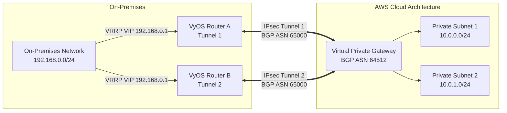

# Lab 01: Hybrid Cloud VPN using AWS and VyOS

Welcome to **Lab 01** of my Network & DevOps Engineering portfolio! This project demonstrates how to securely connect an on-premises data center with an AWS Virtual Private Cloud (VPC) using a Site-to-Site IPsec VPN using static routing.

  📖 Project Overview

This lab is a functional demonstration of Hybrid Cloud Engineering, designed to show how traditional on-premises networking principles (Core/Distribution/Access layers) translate into modern Infrastructure as Code (IaC).

Unlike a standard "Hello World" VPN, this project implements a Zero-Trust architecture with automated lifecycle management:

    Infrastructure: A production-grade AWS VPC with isolated private subnets and a Virtual Private Gateway (VGW).

    On-Prem Simulation: A virtualized VyOS edge router—simulating an enterprise hardware appliance—configured with IPsec VTIs and MSS clamping to optimize MTU for encrypted tunnels.

    Automation: Custom Python tooling that bridges the gap between Terraform outputs and network appliance configuration.

    Validation: An Alpine Linux workload that automatically validates the routing path and data-plane integrity.

## 📌 Architecture Diagram



## 🛠️ Components & Technologies
- **AWS Infrastructure Deployment**: Automated using Terraform structural modules.
- **AWS VPC**: Configured with a `10.0.0.0/16` block.
- **Networking**: Virtual Private Gateway (VGW), Customer Gateway (CGW), and two isolated Private Subnets.
- **On-Premises Side**: A VyOS-based simulated enterprise edge router processing the IPsec Tunnel and VTIs.

## 🗂️ Repository Structure
- `terraform/`: Contains all `main`, `vpn`, and `security` infrastructure modules to deploy the AWS resources.
- `vyos-config.txt`: CLI copy-paste template for immediately bringing up the AWS Tunnel locally on the VyOS router.

## �️ Lab Setup
1. **Hypervisor**: Install VirtualBox or VMware Workstation.
2. **VyOS VM**: Download the VyOS ISO and create a new Virtual Machine.
3. **Network Interfaces**:
   - **eth0 (WAN)**: Set to 'Bridged' or 'NAT' to allow the VM to reach the internet. This interface will form the IPsec tunnel with AWS.
   - **eth1 (LAN)**: Set to 'Host-Only' or 'Internal Network'. Assign this interface the IP `192.168.0.1/24`. This represents your on-premises network.

## 🚀 Deployment Guide
1. **Provision AWS Infrastructure**:
   - Navigate to the `terraform/` directory.
   - Update `variables.tf` with your VyOS VM's public IP address (the IP that AWS will see).
   - Run `terraform init` followed by `terraform apply`.
2. **Retrieve AWS VPN Details**:
   - Extract the Pre-Shared Key (PSK), Outside Tunnel IP, and VTI inside IPs from the AWS VPN configuration output for "Generic" devices.
3. **Configure VyOS**:
   - Open `vyos-config.txt`.
   - Replace the placeholders (`<AWS_TUNNEL_1_IP>`, `<PRE_SHARED_KEY>`, etc.) with your actual values.
   - Paste the commands into the VyOS CLI and run `commit` then `save`.

## 🔍 Verification & Troubleshooting
To verify the IPsec tunnel is operational, run these commands on the VyOS router:

- **Check Phase 1 (IKE) Status**:
  ```bash
  show vpn ike sa
  ```
  *Expected Output: State should be `up`.*

- **Check Phase 2 (IPsec/ESP) Status**:
  ```bash
  show vpn ipsec sa
  ```
  *Expected Output: State should be `up` and Bytes In/Out should reflect traffic passing.*

## 🧪 Data Plane Test
To prove end-to-end connectivity, we will test the data plane from the local LAN to the AWS Private Subnet.

1. **Ping into AWS**:
   From a machine on the `192.168.0.0/24` network (or the VyOS router itself, sourcing from `eth1`), ping an EC2 instance in the AWS Private Subnet:
   ```bash
   ping <AWS_PRIVATE_IP> interface eth1
   ```
2. **Packet Capture (Proof of Nature)**:
   While the ping is running, verify that traffic is being physically routed over the Virtual Tunnel Interface (VTI) and encapsulated by IPsec:
   ```bash
   sudo tcpdump -i vti0 -n
   ```
   *Expected Output: You will see ICMP Echo Requests and Replies flowing directly between your `192.168.0.x` and `10.0.x.x` addresses.*

## 🤖 Automated Live Test
This lab includes fully automated scripts to quickly bring up the environment and test the data plane from a simulated on-premise workload.

### 1. Auto-Generate VyOS Config
Instead of manually copying IP addresses from the AWS console, use the Python generator:
```bash
python scripts/generate_vyos_config.py
```
This script reads the `terraform output` native state and dynamically builds `vyos-config-generated.txt` for immediate deployment.

### 2. Spin Up On-Prem Workload
In the `workload/` directory, provision a lightweight Alpine Linux VM using Vagrant:
```bash
cd workload
vagrant up
vagrant ssh
```
*Note: This Vagrant VM is pre-configured to leverage the VyOS router (`192.168.0.1`) as its exclusive default gateway instead of VirtualBox NAT.*

### 3. Run Automated Validation
From inside the Workload VM, run the validation script against an EC2 instance in the AWS Private Subnet:
```bash
/bin/bash /vagrant/scripts/validate_connectivity.sh <AWS_PRIVATE_IP>
```
The script will actively perform:
- **Traceroute** to ensure traffic flows explicitly through the VyOS IPsec tunnel.
- **MTU/MSS Ping** (1350 bytes) to explicitly prove that packet fragmentation is being handled appropriately without drops.
Results are automatically logged to `/tmp/test-results.log`.

## 🌪️ The Chaos Test (Manual Failover)
Now that BGP and VRRP are configured for Hard Mode, we can simulate a catastrophic failure of Tunnel 1 and watch the network self-heal.

1. **Start a Continuous Ping**:
   From your On-Premises Workload VM, start pinging the AWS Private Subnet:
   ```bash
   ping <AWS_PRIVATE_IP>
   ```
2. **Bring Down Tunnel 1**:
   Log into `Router-A` (the Active VRRP master) and simulate an outage by disabling the VTI interface:
   ```bash
   configure
   set interfaces vti vti0 disable
   commit
   ```
3. **Observe Reconvergence**:
   Watch the ping terminal. You may see a few dropped packets as the BGP Hold Timer expires and VRRP fails over to `Router-B`. Within seconds, traffic will seamlessly reroute over **Tunnel 2** into the AWS VPC Mesh.

🧠 Lessons Learned & Architectural Decisions
1. Translating Physical Layers to Cloud (L2 vs L3)

In the physical data center, I managed Core, Distribution, and Access layers. In this lab, I translated those concepts into AWS logic:

    Core Layer: Represented by the AWS Transit Gateway / Virtual Private Gateway. This handles the high-level routing between the on-prem VyOS and the VPC.

    Distribution Layer: Managed via VPC Route Tables. Instead of physical VLAN tagging and SVIs, I utilized CIDR-based routing to direct traffic to the VPN tunnel.

    Access Layer: Handled by Security Groups and NACLs. This is the "Micro-segmentation" phase where I restricted traffic to the specific workloads, mimicking a physical firewall at the rack level.

2. Why VyOS?

I chose VyOS for the on-prem simulation because it provides a production-grade, CLI-driven experience similar to Cisco/Juniper. This allowed me to practice:

    IPsec Phase 1 & 2 Negotiations: Aligning encryption (AES-256), hashing (SHA-256), and Diffie-Hellman groups between a hardware-like OS and AWS.

    MTU/MSS Clamping: One of the most common "real world" issues in VPNs is packet fragmentation. I configured MSS clamping on the VyOS tunnel interface to ensure smooth traffic flow for larger packets.

3. The "Zero-Trust" Pivot

Unlike a traditional "flat" office-to-DC connection, I implemented a Zero-Trust approach:

    Even though the tunnel is "Up," no traffic is allowed by default.

    I used Stateful Security Groups to ensure that only the simulated "Admin Workstation" on-prem can SSH into the private AWS instances, rather than the entire 192.168.0.0/24 subnet.

